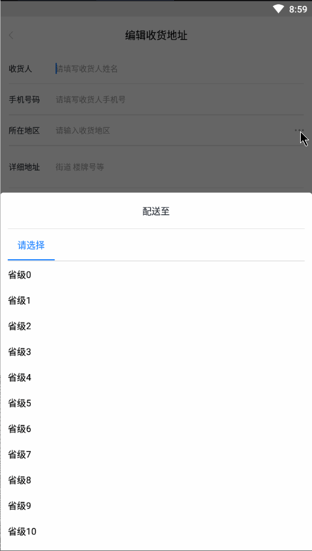

# AddressPickerDialog  一个类似于拼多多的地址选择器
### 效果图：

### 特点
1. 自身没有创建数据库保存全中国地区信息，全部靠回调获取
2. 支持设置最大地区级别，例如：省，市，县，镇就是4级
3. AddressItem实体类用Object作为地区ID以适配不同业务数据，请根据自己业务进行强转
4. 用户最后选完所有地区回调onResult方法，第一个参数为地址字符串，第二个参数为选择的最后一个级别地区的实体

### 使用方法
[参照MainActivity](https://github.com/cyixlq/AddressPickerDialog/blob/master/app/src/main/java/top/cyixlq/addresspickerdialog/MainActivity.java)